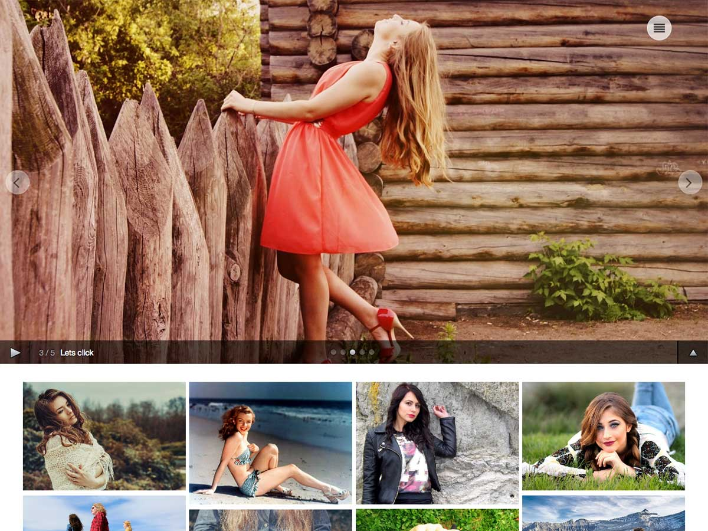

# Click

**Contributors:** acmethemes  
**Requires at least:** 6.6  
**Tested up to:** 7.0  
**Requires PHP:** 7.4  
**Stable tag:** 3.0.0  
**License:** GPLv2 or later  
**License URI:** https://www.gnu.org/licenses/gpl-2.0.html  

> 

Click is a full-screen photography theme built for photo bloggers, professional photographers, and visual artists. Your work takes center stage with a dramatic full-screen slider and a clean masonry gallery layout. Every interaction — from the image zoom on hover to the icon menu toggle — is designed to showcase your portfolio.

## Features

- **Full-screen featured slider** — make a bold first impression
- **Masonry gallery layout** — images flow naturally like a curated grid
- **Icon menu & normal menu** — switch between compact icon mode and full text navigation
- **Image zoom on hover** — subtle interactive effect for every photo
- **"Show More" trigger** — keep your homepage clean and clickable
- **Advanced pagination** — numbered, ajax, or infinite scroll options
- **Flexible sidebar** — left, right, or full-width
- **Related posts** — keep visitors browsing your work
- **Breadcrumb navigation** — clear path through your site
- **Custom colors & background** — personalize without code
- **Custom widgets** — purpose-built for photography sites
- **Translation ready** — .pot file included
- **Responsive & SEO friendly** — looks great and ranks well

## Installation

1. Download the theme zip file.
2. In your WordPress admin, go to **Appearance → Themes**.
3. Click **Add New** → **Upload Theme**.
4. Select the zip file and click **Install Now**.
5. Click **Activate**.

## Frequently Asked Questions

### How do I set up the featured section?

Go to **Appearance → Customize → Featured Section Option**.

### How do I create a full-screen slider on the front page?

Go to **Appearance → Customize → Featured Section Option** and enable it. Then go to **Appearance → Customize → Layout/Design Option** and select **Front Page Full Slider Only**.

## Credits

Click is built on [Underscores](https://underscores.me/) and licensed under GPLv2 or later. It bundles the following third-party resources:

- [Google Fonts](https://fonts.google.com/) — Apache License 2.0
- [Font Awesome](https://fontawesome.com/) — MIT / SIL OFL 1.1
- [normalize.css](https://necolas.github.io/normalize.css/) — MIT
- [Supersized](https://github.com/buildinternet/supersized) — MIT/GPLv2
- [Tooltipster](https://github.com/iamceege/tooltipster) — MIT
- [SlickNav](https://github.com/ComputerWolf/SlickNav) — MIT
- [Breadcrumb Trail](https://github.com/justintadlock/breadcrumb-trail) — GPLv2+
- [html5shiv](https://github.com/afarkas/html5shiv) — MIT
- [Respond.js](https://github.com/scottjehl/Respond) — MIT

---

[Demo](http://demo.acmethemes.com/click) &middot; [Support](https://www.acmethemes.com/supports/) &middot; [Acme Themes](https://www.acmethemes.com)
